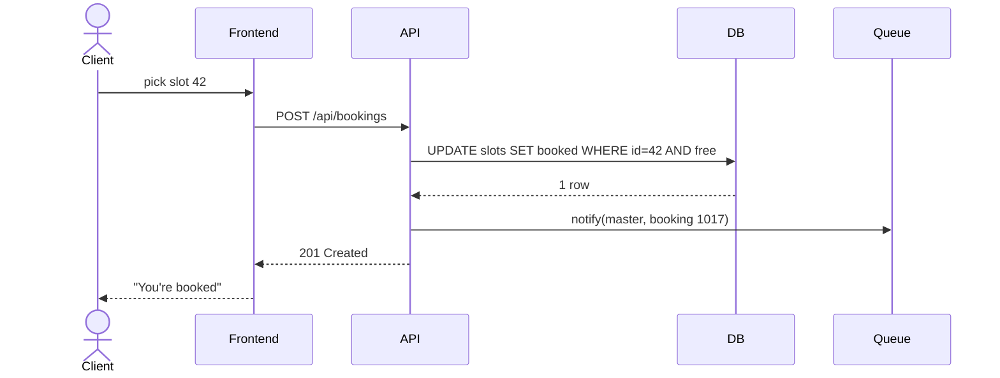
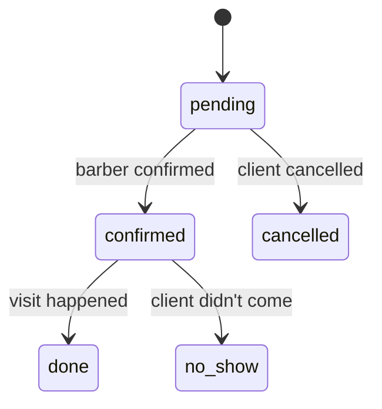
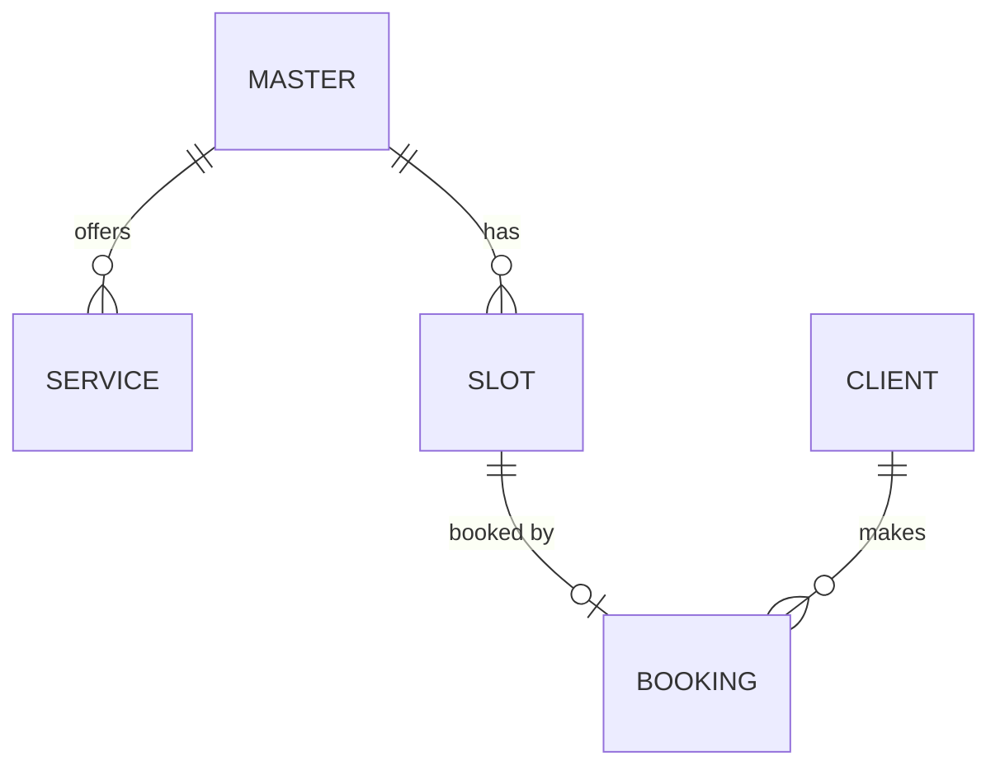

<!-- Slide 1 -->
# Module 1
## Project Documentation: From Idea to Spec
### User story, use case, test case, BPMN, UML, C4 — and how an agent reads them

*Modern Application Architecture: From Idea to a Live Product*

---

<!-- Slide 2 -->
## Session plan

- Why document, and what you can skip
- Vision / PRD
- User story, acceptance criteria, use case, test case
- BPMN: processes
- UML and ER: behavior and data
- C4: architecture
- ADR and OpenAPI
- Docs-as-code and documentation for AI agents
- Lab: the "Slot" spec

---

<!-- Slide 3 -->
## Learning objectives

- Describe a product so a developer, a tester and an agent build **the same thing**
- Know which artifact answers which question
- Write diagrams **as code**, not as pictures
- Keep docs in the repo so an agent can work from them

---

<!-- Slide 4 -->
## Why document

The cost of a misunderstanding grows with every stage:

| Where the mistake was found | Relative cost to fix |
|---|---|
| In the spec | 1× — edit a paragraph |
| In the code | ~10× — rewrite a module |
| In production | ~100× — data, users, reputation |

With an AI agent it's even sharper: the agent **confidently** implements what you wrote, not what you meant.

---

<!-- Slide 5 -->
## The artifact map

| Question | Artifact |
|---|---|
| Why and for whom? | Vision / PRD |
| What does the user want? | User story + acceptance criteria |
| How does the user interact with the system? | Use case |
| How do we check it works? | Test case |
| How does the business process flow? | BPMN |
| How do components talk? What data? | UML (sequence, state), ER |
| What is the system made of? | C4 |
| Why did we decide this way? | ADR |
| What is the API contract? | OpenAPI |

---

<!-- Slide 6 -->
## Vision / PRD

One page that answers:

- **Problem:** the barber takes bookings in a messenger, clients write at night, slots get mixed up
- **Audience:** small businesses with hourly appointments
- **Goals:** a client books in 30 seconds without chatting
- **Non-goals:** online payment, multiple branches (not in v1)
- **Success metrics:** share of bookings made on the site, number of cancellations

**Non-goals** matter as much as goals: they stop people and agents from doing extra work.

---

<!-- Slide 7 -->
## User story

```
As a barbershop client,
I want to see free slots for the week ahead,
so that I can book without messaging the barber.
```

Check against **INVEST**: Independent, Negotiable, Valuable, Estimable, Small, Testable

Bad: "As a user I want a convenient system" — can't be tested, can't be estimated.

---

<!-- Slide 8 -->
## Acceptance criteria: Given / When / Then

```
Scenario: booking a free slot
  Given slot "Fri 15:00" is free
  When  the client selects it and enters name and phone
  Then  the slot is marked as taken
  And   the client sees a confirmation
  And   the barber gets a notification

Scenario: race for one slot
  Given two clients opened slot "Fri 15:00"
  When  both click "Book"
  Then  only the first one gets the booking
  And   the second sees "Slot already taken" and the nearest free slots
```

---

<!-- Slide 9 -->
## Use case: "Book a slot"

- **Actors:** client (primary), barber (gets notified)
- **Preconditions:** the barber has published a schedule
- **Main flow:** 1) client opens the page → 2) picks a service → 3) picks a slot → 4) enters contacts → 5) confirms → 6) the system creates the booking and sends a notification
- **Alternative flows:** 3a — the slot was taken while the client was deciding; 4a — invalid phone number
- **Postconditions:** slot taken, booking in the DB, notification queued

---

<!-- Slide 10 -->
## Test case

| Field | Value |
|---|---|
| ID | TC-07 |
| Title | Booking an already-taken slot |
| Preconditions | Slot 42 is already taken by booking 1017 |
| Steps | `POST /api/bookings` with `slot_id=42` |
| Expected result | `409 Conflict`, body `{"error": "slot_taken"}`, booking 1017 unchanged |
| Traces to | US-03, scenario "race for one slot" |

---

<!-- Slide 11 -->
## The traceability chain

**User story** → **acceptance criteria** → **test case** → **automated test**

- Every automated test references a story or test-case ID
- A requirement changed → you see which tests are affected
- For an agent this is key: a test is an **executable** spec, it can't be "interpreted differently"

---

<!-- Slide 12 -->
## BPMN: the language of business processes

| Element | Shape | Meaning |
|---|---|---|
| Event | Circle | Start, end, timer, message |
| Task | Rounded rectangle | An action by a person or the system |
| Gateway | Diamond | A branch: yes/no, parallel |
| Pool / lane | Band | Who performs it: client, system, barber |
| Sequence flow | Arrow | Execution order |

Both business people and developers read BPMN — that's why it's good for agreeing on a process.

---

<!-- Slide 13 -->
## BPMN: the booking process

- **Client:** picked a slot → entered contacts → (waits)
- **System:** slot free? — **yes:** create booking → queue a notification → show confirmation; **no:** show nearest free slots
- **Barber:** got a notification → (timer 24 h before the visit) → reminder to the client

Stored as BPMN XML (bpmn.io / Camunda Modeler) next to the code.

---

<!-- Slide 14 -->
## UML: which diagrams you actually need

| Diagram | Answers | Does "Slot" need it? |
|---|---|---|
| Use case | Who does what with the system | Yes, one |
| Sequence | Who calls whom, in what order | Yes, for booking |
| State | Which states an object goes through | Yes, for a booking |
| Class | Code structure | Usually no — it's visible in the code |
| Activity | An algorithm step by step | Not if you already have BPMN |

Rule: draw what is **hard to understand from the code**.

---

<!-- Slide 15 -->
## A sequence diagram as code (Mermaid)



---

<!-- Slide 16 -->
## State and ER





---

<!-- Slide 17 -->
## C4: architecture at four zoom levels

1. **Context** — the whole system, its users and external systems
2. **Container** — apps and data stores: frontend, API, DB, queue
3. **Component** — modules inside one container
4. **Code** — classes (almost never drawn)

Like maps: country → city → district → house. For "Slot", levels 1 and 2 are enough.

---

<!-- Slide 18 -->
## C4 Container: "Slot"

- **Client** and **barber** (people)
- **Public site** (Next.js) — shows slots, takes bookings
- **Admin panel** (SPA) — the barber's schedule and bookings
- **API** (FastAPI) — business logic, JSON/HTTPS
- **PostgreSQL** — barbers, services, slots, bookings
- **Redis + worker** — notification queue
- **Telegram / e-mail** — external notification systems

---

<!-- Slide 19 -->
## ADR and OpenAPI

```
ADR-0002: PostgreSQL instead of MongoDB
Status: accepted
Context: bookings, slots and barbers are related; we must prevent double booking
Decision: PostgreSQL, a unique index on slot_id in bookings
Consequences: we need migrations; the slot race is solved by the DB, not the code
```

```yaml
paths:
  /api/bookings:
    post:
      requestBody: { $ref: '#/components/schemas/BookingCreate' }
      responses:
        '201': { description: Booking created }
        '409': { description: Slot already taken }
```

---

<!-- Slide 20 -->
## Docs-as-code

```
docs/
  vision.md
  stories/US-01-view-slots.md ...
  use-cases/UC-01-book-slot.md
  tests/test-cases.md
  bpmn/booking.bpmn
  diagrams/c4-container.md     (Mermaid)
  diagrams/booking-sequence.md (Mermaid)
  adr/0001-monolith.md, 0002-postgres.md
  api/openapi.yaml
```

- Versioned with the code, reviewed in pull requests
- Mermaid renders directly on GitHub/GitLab; PlantUML and BPMN via plugins

---

<!-- Slide 21 -->
## How AI agents read documentation

- **Text beats pictures:** an agent may misread a PNG diagram; it reads Mermaid exactly
- **Structure beats prose:** IDs, lists, tables, Given/When/Then
- **One source of truth:** an agent resolves a contradiction between two files at random
- **Links:** story → test case → code file
- **Entry point:** `AGENTS.md` / `CLAUDE.md` says where everything lives

---

<!-- Slide 22 -->
## AGENTS.md for "Slot"

```markdown
# Slot — rules for agents
- Requirements: docs/stories/; acceptance criteria are the only source of truth
- API contract: docs/api/openapi.yaml — don't add fields that aren't there
- Architecture decisions: docs/adr/ — read before changing structure
- Every new endpoint → a test referencing the story ID
- Changed behavior → update the story and the diagram in the same PR
```

---

<!-- Slide 23 -->
## What a small project can skip

| Must have | Nice to have | Can skip |
|---|---|---|
| A one-page vision | BPMN of the main process | Class diagrams |
| User stories + criteria | Sequence for tricky parts | C4 levels 3–4 |
| OpenAPI | State for key entities | Formal use cases for simple CRUD |
| ADRs for important decisions | ER diagram | Docs nobody updates |

Stale docs are worse than none: they lie with confidence.

---

<!-- Slide 24 -->
## Lab

Write the "Slot" spec in a `docs/` folder:

1. A one-page vision
2. 8–10 user stories with Given/When/Then criteria
3. 2 use cases, 10 test cases
4. Booking BPMN, C4 Container, ER — as code
5. An OpenAPI draft, 2 ADRs, `AGENTS.md`
6. **With an agent:** give the agent only `docs/` and ask it to find contradictions and gaps; then ask it to generate test stubs from the criteria

---

<!-- Slide 25 -->
## Deliverable

- A `docs/` folder with all artifacts
- The list of gaps the agent found and how you fixed them
- Test stubs referencing story IDs

---

<!-- Slide 26 -->
## Recap and next module

- Each artifact answers its own question — don't draw extra
- Acceptance criteria → test cases → automated tests: an executable spec
- Diagrams as code, in the repo, next to the code
- `AGENTS.md` is the agent's entry point
- Next: **Module 2 — Frontend Frameworks**: building the "Slot" public page and admin panel
