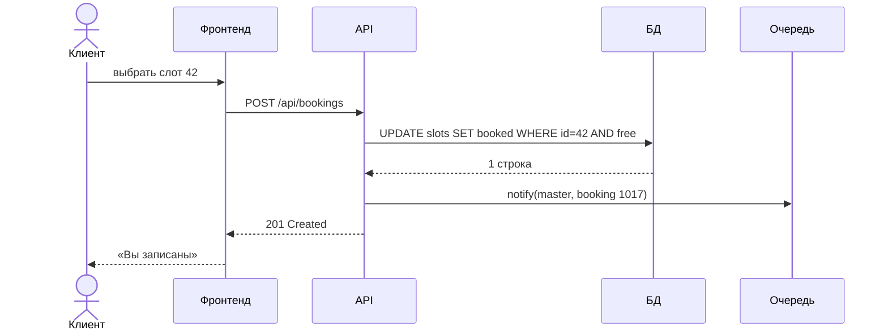
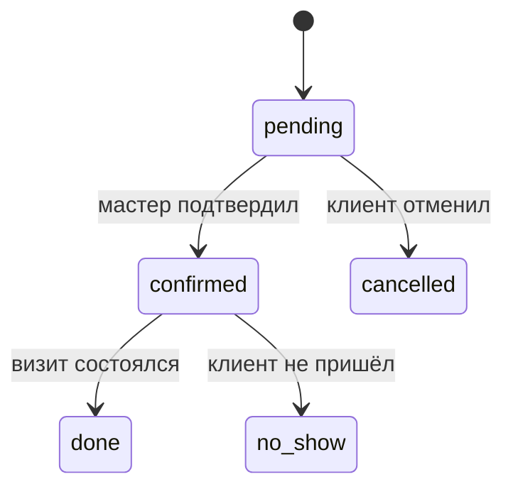
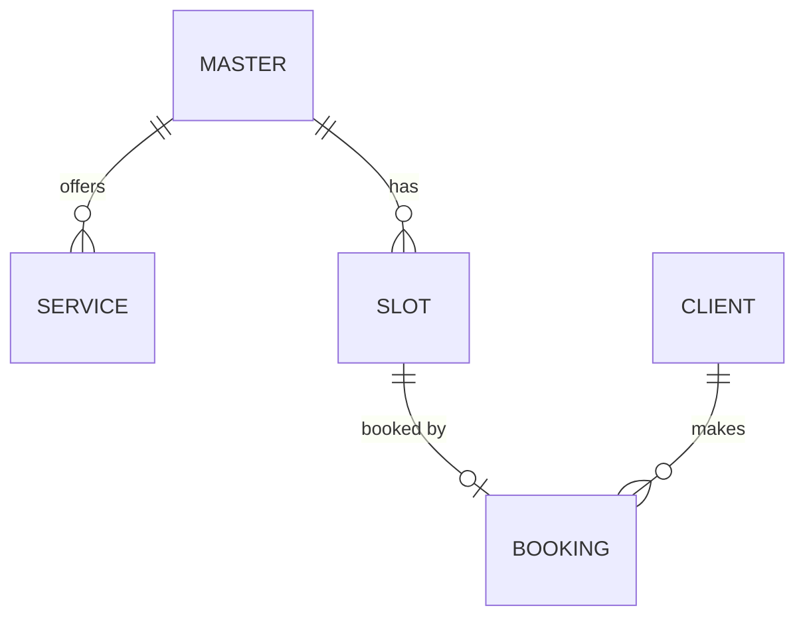

<!-- Slide 1 -->
# Модуль 1
## Документация проекта: от идеи до спецификации
### User story, use case, test case, BPMN, UML, C4 — и как это читает агент

*Архитектура современных приложений: от идеи до живого продукта*

---

<!-- Slide 2 -->
## План занятия

- Зачем документировать и что из этого можно пропустить
- Vision / PRD
- User story, критерии приёмки, use case, test case
- BPMN: процессы
- UML и ER: поведение и данные
- C4: архитектура
- ADR и OpenAPI
- Docs-as-code и документация для ИИ-агентов
- Лабораторная: спецификация «Slot»

---

<!-- Slide 3 -->
## Цели обучения

- Описать продукт так, чтобы разработчик, тестировщик и агент построили **одно и то же**
- Знать, какой артефакт отвечает на какой вопрос
- Писать диаграммы **как код**, а не как картинки
- Хранить документацию в репозитории так, чтобы агент мог по ней работать

---

<!-- Slide 4 -->
## Зачем документировать

Цена недопонимания растёт с каждым этапом:

| Где нашли ошибку | Относительная цена исправления |
|---|---|
| В спецификации | 1× — поправили абзац |
| В коде | ~10× — переписали модуль |
| В продакшене | ~100× — данные, пользователи, репутация |

С ИИ-агентом это ещё острее: агент **уверенно** реализует то, что вы написали, а не то, что вы имели в виду.

---

<!-- Slide 5 -->
## Карта артефактов

| Вопрос | Артефакт |
|---|---|
| Зачем и для кого? | Vision / PRD |
| Что хочет пользователь? | User story + критерии приёмки |
| Как пользователь взаимодействует с системой? | Use case |
| Как проверить, что работает? | Test case |
| Как идёт бизнес-процесс? | BPMN |
| Как общаются компоненты? Какие данные? | UML (sequence, state), ER |
| Из чего состоит система? | C4 |
| Почему решили именно так? | ADR |
| Какой контракт у API? | OpenAPI |

---

<!-- Slide 6 -->
## Vision / PRD

Одна страница, которая отвечает на вопросы:

- **Проблема:** мастер ведёт запись в мессенджере, клиенты пишут ночью, путаница в слотах
- **Аудитория:** малый бизнес с почасовой записью
- **Цели:** клиент записывается за 30 секунд без переписки
- **Не-цели:** онлайн-оплата, мультифилиальность (не в первой версии)
- **Метрики успеха:** доля записей через сайт, число отмен

**Не-цели** важны так же, как цели: они останавливают и людей, и агентов от лишней работы.

---

<!-- Slide 7 -->
## User story

```
Как клиент барбершопа,
я хочу видеть свободные слоты на неделю вперёд,
чтобы записаться без переписки с мастером.
```

Проверка по **INVEST**: Independent, Negotiable, Valuable, Estimable, Small, Testable

Плохо: «Как пользователь я хочу удобную систему» — нельзя проверить, нельзя оценить.

---

<!-- Slide 8 -->
## Критерии приёмки: Given / When / Then

```
Сценарий: запись на свободный слот
  Дано  слот «пт 15:00» свободен
  Когда клиент выбирает его и вводит имя и телефон
  Тогда слот помечается занятым
  И     клиент видит подтверждение
  И     мастер получает уведомление

Сценарий: гонка за один слот
  Дано  два клиента открыли слот «пт 15:00»
  Когда оба нажимают «Записаться»
  Тогда запись получает только первый
  И     второй видит «Слот уже занят» и список ближайших свободных
```

---

<!-- Slide 9 -->
## Use case: «Забронировать слот»

- **Акторы:** клиент (основной), мастер (получает уведомление)
- **Предусловия:** у мастера опубликовано расписание
- **Основной поток:** 1) клиент открывает страницу → 2) выбирает услугу → 3) выбирает слот → 4) вводит контакты → 5) подтверждает → 6) система создаёт запись и шлёт уведомление
- **Альтернативные потоки:** 3a — слот заняли, пока клиент думал; 4a — неверный телефон
- **Постусловия:** слот занят, запись в БД, уведомление в очереди

---

<!-- Slide 10 -->
## Test case

| Поле | Значение |
|---|---|
| ID | TC-07 |
| Название | Повторная запись на занятый слот |
| Предусловия | Слот 42 уже занят записью 1017 |
| Шаги | `POST /api/bookings` с `slot_id=42` |
| Ожидаемый результат | `409 Conflict`, тело `{"error": "slot_taken"}`, запись 1017 не изменилась |
| Связь | US-03, сценарий «гонка за один слот» |

---

<!-- Slide 11 -->
## Цепочка трассировки

**User story** → **критерии приёмки** → **test case** → **автотест**

- Каждый автотест ссылается на ID истории или тест-кейса
- Изменили требование → видно, какие тесты затронуты
- Для агента это главное: тест — это **исполняемая** спецификация, его нельзя «понять по-своему»

---

<!-- Slide 12 -->
## BPMN: язык бизнес-процессов

| Элемент | Обозначение | Смысл |
|---|---|---|
| Событие | Круг | Начало, конец, таймер, сообщение |
| Задача | Прямоугольник со скруглением | Действие человека или системы |
| Шлюз | Ромб | Развилка: «да/нет», параллельно |
| Пул / дорожка | Полоса | Кто выполняет: клиент, система, мастер |
| Поток | Стрелка | Порядок выполнения |

BPMN читают и бизнес, и разработчики — поэтому он хорош для согласования процесса.

---

<!-- Slide 13 -->
## BPMN: процесс бронирования

- **Клиент:** выбрал слот → ввёл контакты → (ждёт)
- **Система:** слот свободен? — **да:** создать запись → поставить уведомление в очередь → показать подтверждение; **нет:** показать ближайшие свободные
- **Мастер:** получил уведомление → (таймер 24 ч до визита) → напоминание клиенту

Храним как BPMN XML (bpmn.io / Camunda Modeler) рядом с кодом.

---

<!-- Slide 14 -->
## UML: какие диаграммы реально нужны

| Диаграмма | Отвечает на вопрос | Нужна «Slot»? |
|---|---|---|
| Use case | Кто что делает с системой | Да, одна |
| Sequence | Кто кого вызывает и в каком порядке | Да, для бронирования |
| State | Через какие состояния проходит объект | Да, для записи |
| Class | Структура кода | Обычно нет — её видно в коде |
| Activity | Алгоритм шаг за шагом | Если BPMN уже есть — нет |

Правило: рисуем то, что **трудно понять из кода**.

---

<!-- Slide 15 -->
## Sequence-диаграмма как код (Mermaid)



---

<!-- Slide 16 -->
## State и ER





---

<!-- Slide 17 -->
## C4: архитектура на четырёх уровнях масштаба

1. **Context** — система целиком, её пользователи и внешние системы
2. **Container** — приложения и хранилища: фронтенд, API, БД, очередь
3. **Component** — модули внутри одного контейнера
4. **Code** — классы (почти никогда не рисуют)

Как карты: страна → город → район → дом. Для «Slot» достаточно уровней 1 и 2.

---

<!-- Slide 18 -->
## C4 Container: «Slot»

- **Клиент** и **мастер** (люди)
- **Публичный сайт** (Next.js) — показывает слоты, принимает запись
- **Админка** (SPA) — расписание и записи мастера
- **API** (FastAPI) — бизнес-логика, JSON/HTTPS
- **PostgreSQL** — мастера, услуги, слоты, записи
- **Redis + воркер** — очередь уведомлений
- **Telegram / e-mail** — внешние системы уведомлений

---

<!-- Slide 19 -->
## ADR и OpenAPI

```
ADR-0002: PostgreSQL вместо MongoDB
Статус: принято
Контекст: записи, слоты и мастера связаны; нужна защита от двойной записи
Решение: PostgreSQL, уникальный индекс на slot_id в bookings
Последствия: нужны миграции; гонку за слот решает БД, а не код
```

```yaml
paths:
  /api/bookings:
    post:
      requestBody: { $ref: '#/components/schemas/BookingCreate' }
      responses:
        '201': { description: Запись создана }
        '409': { description: Слот уже занят }
```

---

<!-- Slide 20 -->
## Docs-as-code

```
docs/
  vision.md
  stories/US-01-view-slots.md ...
  use-cases/UC-01-book-slot.md
  tests/test-cases.md
  bpmn/booking.bpmn
  diagrams/c4-container.md     (Mermaid)
  diagrams/booking-sequence.md (Mermaid)
  adr/0001-monolith.md, 0002-postgres.md
  api/openapi.yaml
```

- Версионируется вместе с кодом, ревьюится в pull request
- Mermaid рендерится прямо в GitHub/GitLab; PlantUML и BPMN — плагинами

---

<!-- Slide 21 -->
## Как ИИ-агенты читают документацию

- **Текст лучше картинок:** PNG-диаграмму агент может неверно распознать; Mermaid читает точно
- **Структура лучше прозы:** ID, списки, таблицы, Given/When/Then
- **Одно место правды:** противоречие между двумя файлами агент разрешит случайно
- **Ссылки:** история → тест-кейс → файл кода
- **Входная точка:** `AGENTS.md` / `CLAUDE.md` говорит, где что лежит

---

<!-- Slide 22 -->
## AGENTS.md для «Slot»

```markdown
# Slot — правила для агентов
- Требования: docs/stories/, критерии приёмки — единственный источник правды
- API-контракт: docs/api/openapi.yaml — не добавляй поля, которых там нет
- Архитектурные решения: docs/adr/ — читай перед изменением структуры
- Каждый новый эндпоинт → тест со ссылкой на ID истории
- Изменил поведение → обнови историю и диаграмму в том же PR
```

---

<!-- Slide 23 -->
## Что маленькому проекту можно пропустить

| Обязательно | Желательно | Можно пропустить |
|---|---|---|
| Vision на страницу | BPMN главного процесса | Class-диаграммы |
| User stories + критерии | Sequence для сложных мест | C4 уровней 3–4 |
| OpenAPI | State для ключевых сущностей | Формальные use case для простых CRUD |
| ADR для важных решений | ER-диаграмма | Документы, которые никто не обновляет |

Устаревшая документация хуже отсутствующей: она уверенно врёт.

---

<!-- Slide 24 -->
## Лабораторная работа

Напишите спецификацию «Slot» в папке `docs/`:

1. Vision на одну страницу
2. 8–10 user stories с критериями Given/When/Then
3. 2 use case, 10 test case
4. BPMN бронирования, C4 Container, ER — как код
5. Черновик OpenAPI, 2 ADR, `AGENTS.md`
6. **С агентом:** дайте агенту только `docs/` и попросите найти противоречия и пробелы; затем — сгенерировать заготовки тестов по критериям

---

<!-- Slide 25 -->
## Результат

- Папка `docs/` со всеми артефактами
- Список пробелов, которые нашёл агент, и как вы их исправили
- Заготовки тестов со ссылками на ID историй

---

<!-- Slide 26 -->
## Итоги и следующий модуль

- Каждый артефакт отвечает на свой вопрос — не рисуем лишнего
- Критерии приёмки → тест-кейсы → автотесты: исполняемая спецификация
- Диаграммы — как код, в репозитории, рядом с кодом
- `AGENTS.md` — входная точка для агента
- Далее: **Модуль 2 — Фронтенд-фреймворки**: строим публичную страницу и админку «Slot»
